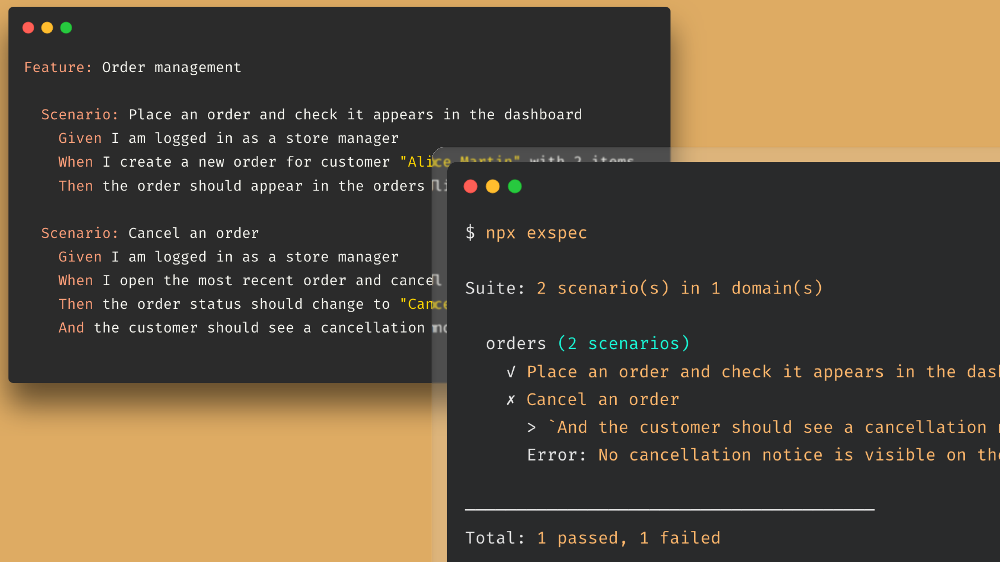

# Executable specs

AI writes code. AI writes tests. But confidence comes from tests you actually read and write.

**exspec runs plain-text specs in a real browser using AI.**
No test code, no step definitions. Write specs as acceptance criteria, then let agents build and run exspec to check they pass.



## Example

```gherkin
Feature: Order management

  Scenario: Place an order and check it appears in the dashboard
    Given I am logged in as a store manager
    When I create a new order for customer "Alice Martin" with 2 items
    Then the order should appear in the orders list with status "Pending"

  Scenario: Cancel an order
    Given I am logged in as a store manager
    And there is at least one pending order
    When I open the most recent order and cancel it
    Then the order status should change to "Cancelled"
    And the customer should see a cancellation notice
```

```bash
$ npx exspec

Suite: 2 scenario(s) in 1 domain(s)

  orders (2 scenarios)
    ✓ Place an order and check it appears in the dashboard
    ✗ Cancel an order
      > `And the customer should see a cancellation notice`
      Error: No cancellation notice is visible on the page.

────────────────────────────────────────
Total: 1 passed, 1 failed, 0 skipped, 0 not executed

Detailed results in features/exspec/2026-03-20-1430.md
```

Unlike [Cucumber](https://github.com/cucumber/cucumber-js) or [Behat](https://github.com/Behat/Behat), there's **no glue code** - no step definitions, no page objects, no regex matchers to wire up. The AI agent reads your specs and navigates the app like a real user would. It figures out where to click, what to fill in, and what to check on screen.

This also means specs aren't brittle. Traditional browser tests break when a CSS class changes or a button moves. The AI agent adapts to the actual UI - and if the UX is so broken that a human couldn't complete the task, the spec fails too. That's a feature, not a bug.

Specs are written in [Gherkin](https://cucumber.io/docs/gherkin/reference/), a simple Given/When/Then format. You can write them in [70+ languages](https://cucumber.io/docs/gherkin/languages/) (English, French, German, Spanish, etc.).

## Install

```bash
npm install -D @mnapoli/exspec
```

### Prerequisites

- [Claude Code CLI](https://docs.anthropic.com/en/docs/claude-code) installed and authenticated

## Quick start

1. Create a `features/exspec.md` configuration file:

```markdown
URL: http://localhost:3000

Use the `test@example.com` / `password` credentials for authentication.
```

2. Write a feature file in `features/`:

```gherkin
Feature: Shopping cart

  Scenario: Add a product to the cart
    Given I am logged in
    When I navigate to the product catalog
    And I add the first product to my cart
    Then the cart should show 1 item
```

3. Run:

```bash
npx exspec
```

That's it. No step definitions to implement, no test code to write.

## Usage

```bash
# Run all feature files
npx exspec

# Run a specific file or directory
npx exspec features/auth/login.feature
npx exspec features/auth/

# Filter by scenario name
npx exspec --filter "invalid password"

# Stop at first failure
npx exspec --fail-fast

# Run with visible browser (for debugging)
npx exspec --headed
```

## Configuration

### `features/exspec.md`

This file is passed to the AI agent as context. Describe your app, provide credentials, set the URL - anything the agent needs to know to test your application.

```markdown
URL: http://localhost:3000

## Application

This is an e-commerce app. The user is a store manager.
For detailed feature documentation, see the `docs/` directory.

## Authentication

Use the `test@example.com` / `password` credentials for authentication.

## Browser

Resolution: 1920x1080
```

### Setup commands

You can run shell commands before tests start using YAML frontmatter in `exspec.md`. This is useful for resetting the database, seeding data, or any other preparation needed before testing.

```markdown
---
setup: php artisan migrate:fresh --seed
---

URL: http://localhost:3000
...
```

Setup commands run once before all tests, on the local machine. You can also provide a list of commands:

```markdown
---
setup:
  - php artisan migrate:fresh --seed
---
```

### Environment variables

If your project has a `.env` file, exspec loads it automatically. You can reference variables in `exspec.md` with `$VAR` or `${VAR}` syntax:

```markdown
URL: $APP_URL
```

## How it works

1. Discovers `.feature` files in `features/` and groups them by subdirectory
2. For each group, launches a Claude agent with only Playwright browser tools (no database, no code, no shell access)
3. The agent reads your specs and interacts with the browser autonomously
4. Results (PASS/FAIL/SKIP) are written to `features/exspec/`

The agent is sandboxed to browser-only interaction. If a scenario can't be verified through the browser, it's marked as FAIL.

## Results

Results are written to `features/exspec/{YYYY-MM-DD-HHmm}.md` with failure screenshots.

The CLI exits with code `1` on failures (CI-friendly).
